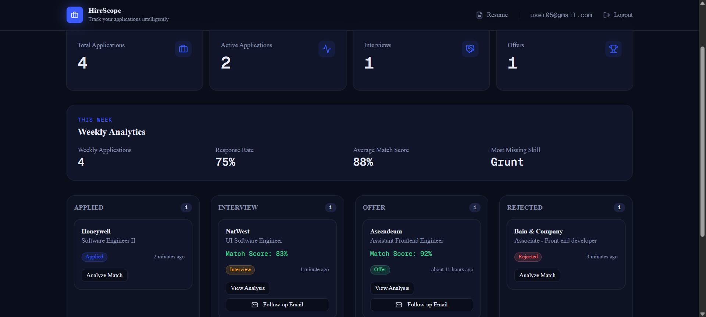

# HireScope

An AI-powered job application tracker that replaces the spreadsheet — a live Kanban pipeline, AI resume-to-JD match scoring, an analytics dashboard, and auto-generated follow-up emails, all in one place.



## Features

- **Kanban pipeline** — drag applications through Applied → Interview → Offer → Rejected, with status changes persisted instantly.
- **AI match scoring** — upload a resume and a job description; Gemini scores the fit, surfaces strengths and missing skills, and suggests improvements.
- **Analytics dashboard** — weekly application volume, response rate, average match score, and your most commonly missing skill at a glance.
- **AI follow-up emails** — generate a tailored follow-up email for any application in one click.
- **Resume management** — upload and store multiple resumes, parsed and ready for matching against new job descriptions.
- **Authentication** — email/password and Google sign-in via Auth.js.

## Tech stack

| Layer         | Choice                               |
| ------------- | ------------------------------------ |
| Framework     | Next.js 15 (App Router)              |
| Language      | TypeScript                           |
| Styling       | Tailwind CSS v4                      |
| Database      | Neon (serverless PostgreSQL)         |
| ORM           | Prisma                               |
| Auth          | Auth.js (credentials + Google OAuth) |
| AI            | Gemini API                           |
| Drag and drop | @hello-pangea/dnd                    |
| Deployment    | Vercel                               |

## Getting started

### Prerequisites

- Node.js 18+
- A [Neon](https://neon.tech) PostgreSQL database (or any Postgres instance)
- A [Google Gemini API key](https://ai.google.dev/)
- Google OAuth credentials (if you want Google sign-in)

### 1. Clone and install

```bash
git clone https://github.com/<your-username>/hirescope.git
cd hirescope
npm install
```

### 2. Configure environment variables

Create a `.env.local` file in the project root:

```bash
# Database
DATABASE_URL="your-neon-connection-string"

# Auth.js
AUTH_SECRET="generate-with-npx-auth-secret"
GOOGLE_CLIENT_ID="your-google-client-id"
GOOGLE_CLIENT_SECRET="your-google-client-secret"

# AI
GEMINI_API_KEY="your-gemini-api-key"
```

> Adjust variable names above to match whatever your `lib/auth.ts` and `lib/db.ts` actually expect — update this section once confirmed.

### 3. Set up the database

```bash
npx prisma generate
npx prisma migrate dev
```

### 4. Run the dev server

```bash
npm run dev
```

Visit [http://localhost:3000](http://localhost:3000).

## Project structure

```
app/
  (auth)/
    login/          Sign-in page
    signup/         Sign-up page
  dashboard/
    page.tsx        Kanban board + stats + analytics
    resume/         Resume upload and management
  api/               Route handlers (signup, etc.)
components/
  auth/              Login/signup forms, auth layout, logout
  dashboard/         Header, stats cards, analytics, add-application dialog
  kanban/            Board, columns, application cards
  resume/            Resume upload
  ui/                Shared shadcn primitives
lib/                 Auth config, Prisma client, analytics helpers
actions/             Server actions (applications, resume, etc.)
```

## Roadmap

- [ ] Email reminders for stale applications
- [ ] Export pipeline to CSV
- [ ] Multi-resume matching comparison

# 👨‍💻 Author

**Keerthana E**

- GitHub: https://github.com/keerthana0403
- LinkedIn: https://www.linkedin.com/in/keerthana-e-a3055a1b5/

---

## ⭐ Show your support

If you found this project useful, please consider giving it a **⭐ Star** on GitHub.
